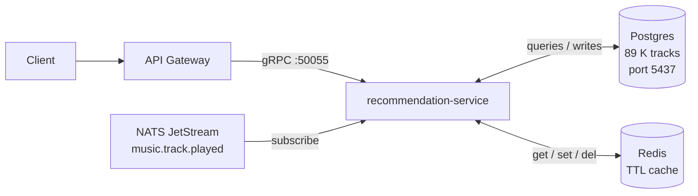

# recommendation-service

Go microservice that serves mood-based and personalised track recommendations from a seeded Spotify dataset (89,741 tracks). It exposes five gRPC endpoints: mood matching, similar-track lookup, personal recommendations derived from play history, the signature **Mood Radio** feature that builds a 30-track playlist with a warm-up → peak → cool-down emotional arc, and a playback-recording endpoint that continuously refines the user's taste profile via weighted moving average.

---

## Architecture



---

## Key features

| Feature | Detail |
|---|---|
| **8 mood vectors** | `happy` `sad` `energetic` `chill` `focus` `workout` `romantic` `angry` — each mapped to a `[valence, energy, danceability, tempo_norm]` target |
| **Cosine similarity ranking** | Candidates fetched from Postgres, re-ranked in Go; Euclidean distance breaks ties |
| **Mood Radio arc** | 30-track playlist: 10-track warm-up (mid-similarity, ascending), 10-track peak (high-similarity, popularity-ranked), 10-track cool-down (mid-similarity, descending) |
| **User taste profiles** | `play_count`-weighted moving average updated atomically in a single SQL upsert |
| **Redis caching** | Mood top-100 cached at `mood:{mood}:top` (TTL 1 h); personal recs invalidated on every play at `user:{id}:recommendations` |

---

## Setup

### 1. Download the dataset

Download the Spotify Tracks Dataset from Kaggle:  
<https://www.kaggle.com/datasets/maharshipandya/-spotify-tracks-dataset/data>

Save the file as:
```
backend/recommendation-service/data/spotify_tracks.csv
```

### 2. Start infrastructure

From the `backend/` directory:
```bash
docker compose up -d postgres-recommendation redis nats
```

### 3. Source environment variables

```bash
set -a && source ../../.env && set +a
```

### 4. Run the seeder

```bash
go run ./cmd/seed
```

Expected output: `inserted 89741 tracks (24259 skipped as duplicates)`.

### 5. Run the service

```bash
go run ./cmd/main.go
```

The service starts on `:50055` (gRPC) and `:9090` (Prometheus metrics).

---

## API examples

Requires [`grpcurl`](https://github.com/fullstorydev/grpcurl). The service registers gRPC reflection, so no proto file is needed.

**Get tracks by mood**
```bash
grpcurl -plaintext -d '{"mood": "focus", "limit": 10}' \
  localhost:50055 recommendation.RecommendationService/GetRecommendationsByMood
```

**Get similar tracks**
```bash
grpcurl -plaintext -d '{"track_id": "<track-uuid>", "limit": 10}' \
  localhost:50055 recommendation.RecommendationService/GetSimilarTracks
```

**Get personal recommendations**
```bash
grpcurl -plaintext -d '{"user_id": "<user-uuid>", "limit": 20}' \
  localhost:50055 recommendation.RecommendationService/GetPersonalRecommendations
```

**Get Mood Radio playlist (30 tracks)**
```bash
grpcurl -plaintext -d '{"mood": "workout"}' \
  localhost:50055 recommendation.RecommendationService/GetMoodRadio
```

**Record a playback event**
```bash
grpcurl -plaintext -d '{"user_id": "<user-uuid>", "track_id": "<track-uuid>"}' \
  localhost:50055 recommendation.RecommendationService/RecordPlayback
```

---

## Testing

**Unit tests** (no external dependencies):
```bash
go test ./... -short
```

**Integration tests** (requires Docker):
```bash
go test -tags=integration -v -count=1 ./internal/repository/postgres/...
```

Integration tests spin up a throwaway Postgres container via testcontainers-go, run migrations, and exercise both repositories end-to-end.

---

## Known limitations

- **Sad / angry moods return less-extreme tracks than the vectors suggest.** The dataset has very few popular tracks (popularity ≥ 30) with valence below 0.2. Results are the closest available tracks, not the intended mood extreme. Empirical tuning of `minPopularity` or the valence target may help.
- **~24 K duplicate rows in the dataset.** The Spotify CSV lists the same `track_id` under multiple genres; the seeder silently skips duplicates via `ON CONFLICT DO NOTHING`, resulting in 89,741 unique tracks out of 114,000 rows.
- **`music.track.played` event is not yet published by music-service.** The NATS subscriber is wired up and ready, but the upstream service does not emit this event. Use the `RecordPlayback` gRPC endpoint directly as a workaround until music-service is updated.
- **No collaborative filtering.** Recommendations are purely audio-feature-based. A future improvement is neighbourhood-based or matrix-factorisation collaborative filtering once sufficient play history accumulates.
- **No genre-aware mood matching.** The `GetCandidatesForMood` query filters only by popularity. A follow-up improvement is genre affinity per mood (e.g. `workout` → electronic/hip-hop) using the `genre` column.
